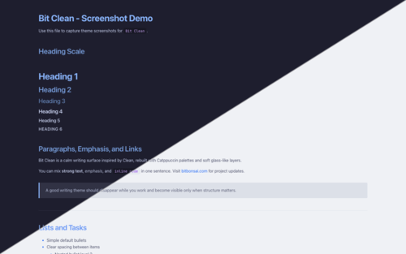

   
  
  <h1>Bit Clean</h1>
  
Clean-inspired Typora themes with Catppuccin palettes, soft glass layers, and a calm writing-first layout.

  
Available in <b>Dark</b> &amp; <b>Light</b> modes

  

    <a href="#install">Install</a>
    ·
    <a href="#preview-assets">Preview Assets</a>
    ·
    <a href="#author">Author</a>
  

  

## Features

- Dual variants: Bit Clean Light (Latte) and Bit Clean Dark (Mocha).
- Soft glass-style surfaces for code blocks, tables, and UI chrome.
- Balanced typography and spacing tuned for long-form readability.
- Catppuccin-aligned syntax accents with polished inline code styling.
- Refined Typora UI coverage: sidebar, search, dialogs, tooltips, and task lists.

## Install

1. Open Typora and go to Preferences -> Appearance -> Open Theme Folder.
2. Copy `bit-clean/bit-clean-light.css` and `bit-clean/bit-clean-dark.css` into Typora's theme folder.
3. Restart Typora.
4. Select `Bit Clean Light` or `Bit Clean Dark` from the Themes menu.

## Preview Assets

Gallery submission asset (500x400): `bit-clean/preview/bit-clean-thumbnail.png`.

Full-size preview images are on `bit-clean/README.md`.

Screenshot test page: `bit-clean/markdown-demo.md`.

## Project Files

- Theme CSS: `bit-clean/bit-clean-light.css`, `bit-clean/bit-clean-dark.css`
- Image prompts: `prompts/screenshot-prompts.md`
- Typora gallery submission draft: `submission/typora-theme-gallery-post.md`
- Repository architecture notes: `ARCHITECTURE.md`

## Platform Note

Designed and tested on macOS. Not fully tested, but should work on Windows/Linux.

## Author

Mauricio Wolff ([bitbonsai](https://github.com/bitbonsai))

Website: https://bitbonsai.com

## License

MIT. See `LICENSE`.
