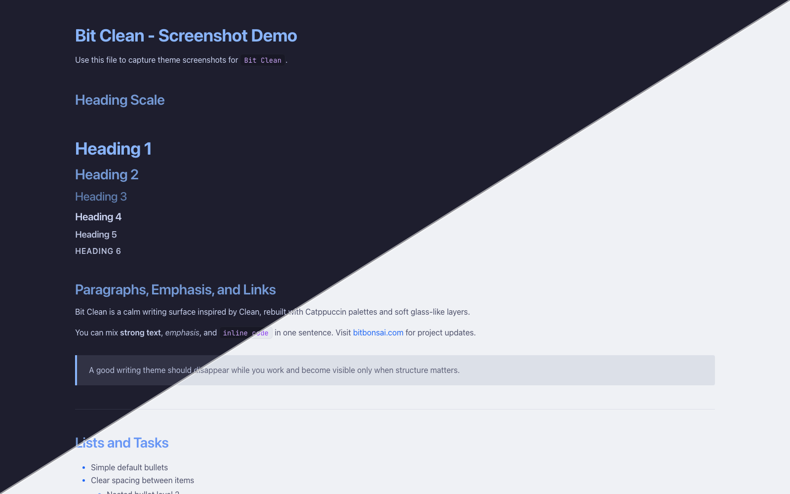
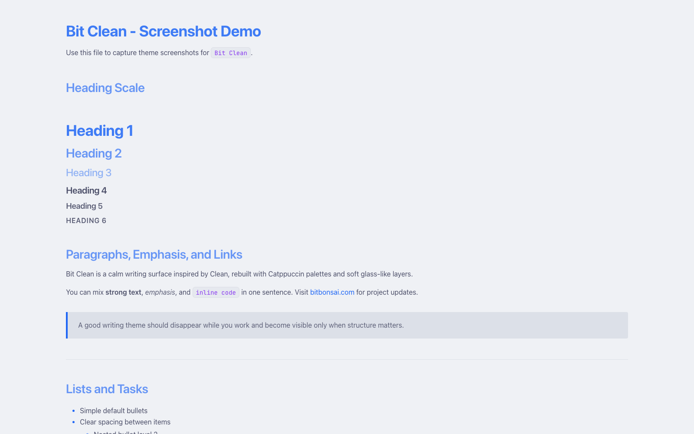
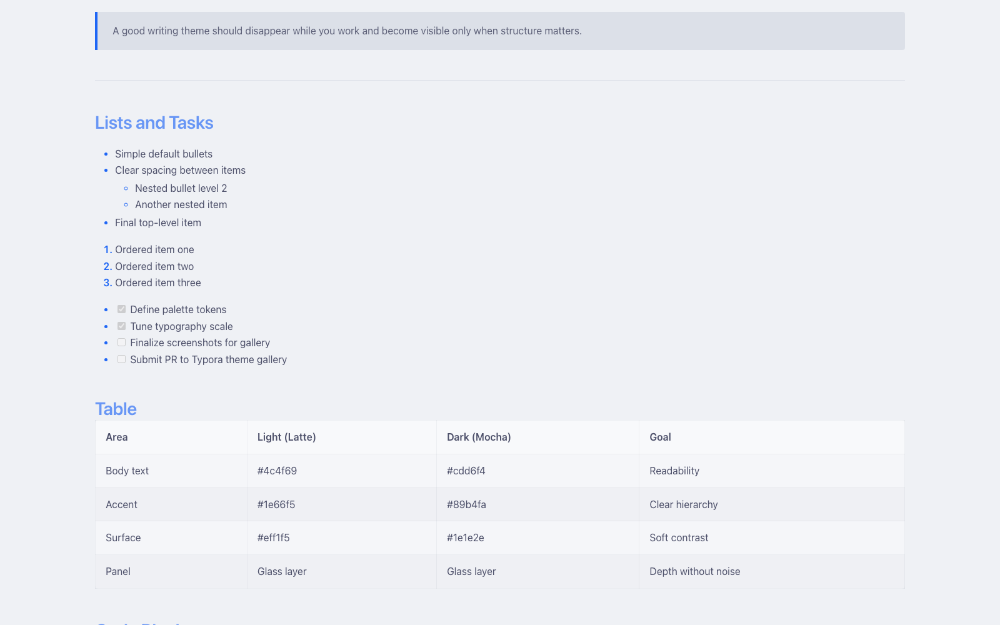
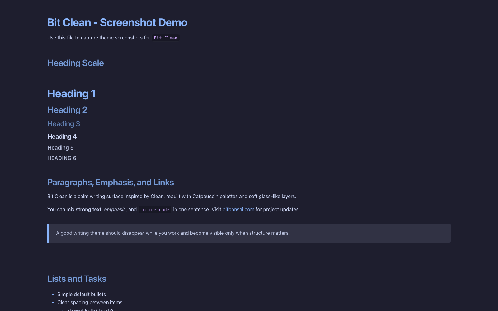
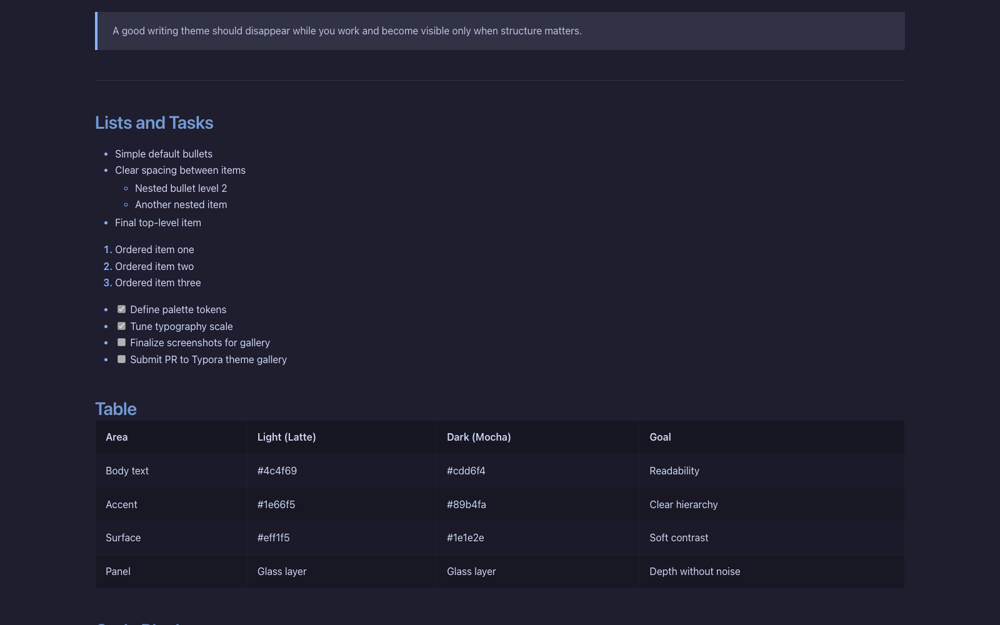

   
  
  <h1>Bit Clean</h1>
  
Theme package directory for Typora.

Bit Clean includes two variants:

- `bit-clean-light.css` (Catppuccin Latte)
- `bit-clean-dark.css` (Catppuccin Mocha)

## Full-size Preview Images

## Screenshot Workflow

1. Open `markdown-demo.md` in Typora.
2. Switch to `Bit Clean Light` and capture 2-3 screenshots.
3. Switch to `Bit Clean Dark` and capture 2-3 screenshots.
4. Save images in this folder's `preview/` directory using the names below.

### Suggested Filenames

- `bit-clean-thumbnail.png` (500x400)
- `bit-clean-light-1.png`
- `bit-clean-light-2.png`
- `bit-clean-dark-1.png`
- `bit-clean-dark-2.png`

## Typora Gallery Links

Use these stable links in your gallery post once images are pushed:

- Thumbnail:
  - `https://raw.githubusercontent.com/bitbonsai/typora-bit-clean/main/bit-clean/preview/bit-clean-thumbnail.png`
- Screenshots:
  - `https://raw.githubusercontent.com/bitbonsai/typora-bit-clean/main/bit-clean/preview/bit-clean-light-1.png`
  - `https://raw.githubusercontent.com/bitbonsai/typora-bit-clean/main/bit-clean/preview/bit-clean-light-2.png`
  - `https://raw.githubusercontent.com/bitbonsai/typora-bit-clean/main/bit-clean/preview/bit-clean-dark-1.png`
  - `https://raw.githubusercontent.com/bitbonsai/typora-bit-clean/main/bit-clean/preview/bit-clean-dark-2.png`
