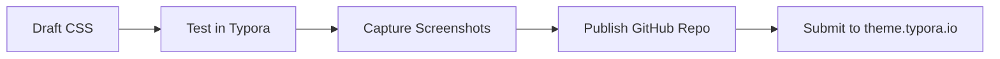

# Bit Clean - Screenshot Demo

Use this file to capture theme screenshots for `Bit Clean`.

## Heading Scale

# Heading 1
## Heading 2
### Heading 3
#### Heading 4
##### Heading 5
###### Heading 6

## Paragraphs, Emphasis, and Links

Bit Clean is a calm writing surface inspired by Clean, rebuilt with Catppuccin palettes and soft glass-like layers.

You can mix **strong text**, *emphasis*, and `inline code` in one sentence. Visit [bitbonsai.com](https://bitbonsai.com) for project updates.

> A good writing theme should disappear while you work and become visible only when structure matters.

---

## Lists and Tasks

- Simple default bullets
- Clear spacing between items
  - Nested bullet level 2
  - Another nested item
- Final top-level item

1. Ordered item one
2. Ordered item two
3. Ordered item three

- [x] Define palette tokens
- [x] Tune typography scale
- [ ] Finalize screenshots for gallery
- [ ] Submit PR to Typora theme gallery

## Table

| Area      | Light (Latte) | Dark (Mocha) | Goal |
|-----------|----------------|--------------|------|
| Body text | #4c4f69        | #cdd6f4      | Readability |
| Accent    | #1e66f5        | #89b4fa      | Clear hierarchy |
| Surface   | #eff1f5        | #1e1e2e      | Soft contrast |
| Panel     | Glass layer    | Glass layer  | Depth without noise |

## Code Blocks

```bash
gh repo create bitbonsai/typora-bit-clean --public --source . --remote origin
gh auth status
```

```css
:root {
  --bg-primary: #eff1f5;
  --text-primary: #4c4f69;
  --accent-blue: #1e66f5;
}

#write h2 {
  color: var(--accent-blue);
}
```

```javascript
function themeMessage(mode) {
  return mode === "dark"
    ? "Quiet focus with soft glow"
    : "Clean clarity with gentle depth";
}
```

## Math and Diagram

Inline math: $E = mc^2$

$$
\int_0^1 x^2 \, dx = \frac{1}{3}
$$



## Mixed Content

```json
{
  "theme": "Bit Clean",
  "author": "Mauricio Wolff",
  "github": "bitbonsai",
  "license": "MIT"
}
```

Final line for cursor and selection tests.
